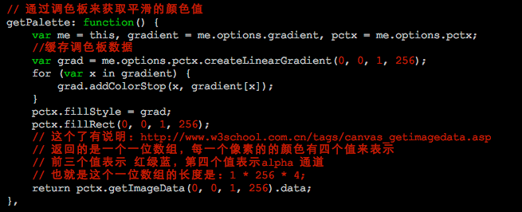
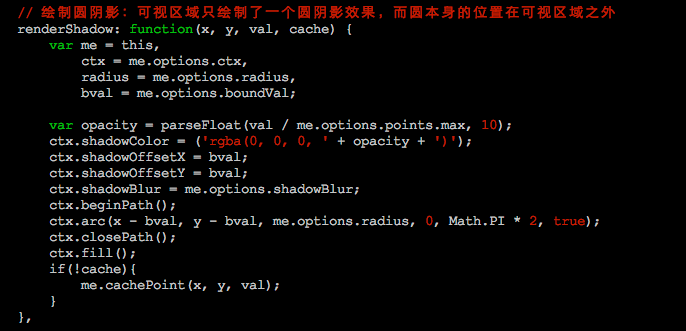
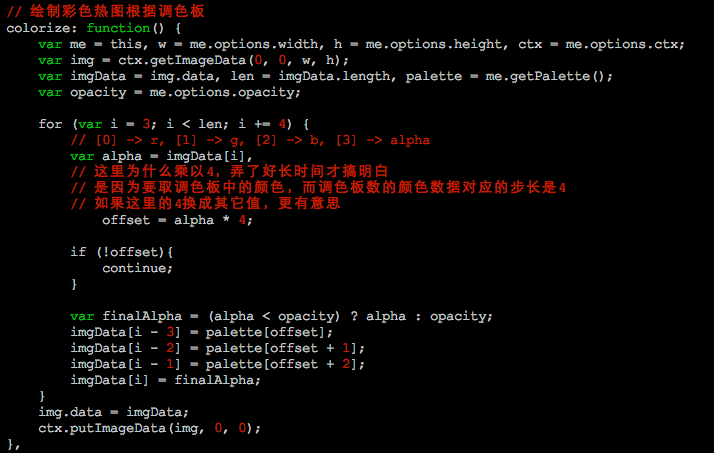

热度图(热点图)
==============

阅读了[heatmap.js](https://github.com/pa7/heatmap.js) v1 源代码，作者的实现思路很赞，
但是代码实现很啰嗦，包括每次画热点，都要计算热点边界, 如果是性能的考虑，我测了一下啊，
每次计不计算，没有多大的差别。我重新实现了一下，核心代码不到140行。

热点图的实现思路如下：

1. 绘制调色板 

2. 绘制模糊阴影 

3. 根据模糊阴影的alpha，到调色板中得道对应的颜色值，得道彩色热图 

